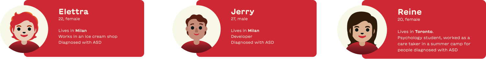

## Brief

**Natural Interactions**:
Creating a delightful user experience through naturalness.

**City for All**:
Addressing the challenges of citizens in a smart environment.

### Natural Interaction

_How did we interpret this concept?_

For us Natural interactions are any way of communicating with an animate or inanimate entity intuitively, providing a contextual understanding and knowledge.

It revolves around the concepts of **unobtrusiveness** and **intuition**.

A natural interaction utilizes [tacit knowledge](https://www.sciencedirect.com/topics/computer-science/tacit-knowledge) in the following four categories: simple physics (gravity, friction, persistence of objects, relative scale); body awareness (proprioception, range of motion, two-handed coordination, whole-body interaction); environment awareness (navigation, depth perception, distance between objects); and social awareness and skills (presence of others, verbal and nonverbal communication).

## Our Research path

_Fig. 1.1 – Our Methodology_

### Literature research

We started our research focusing on neurodivergent people, trying to understand the broad spectrum of neurological differences, including Autism Spectrum Disorder (ASD), ADHD, and dyslexia, among others. We recognized the importance of acknowledging these differences, as they represent the diverse ways in which the brain functions and interprets information.

In our research, we decided to put a particular emphasis on ASD. We've learned that ASD is not just about the challenges it presents but also involves a unique set of cognitive and social traits. The literature we've reviewed marks a significant shift from viewing ASD through a deficit-focused lens to a more comprehensive understanding of its characteristics. We've delved into how ASD affects cognitive processing and social interactions, gaining a more nuanced understanding of this condition.

Furthermore, our research has led us to examine the impact of sports and physical activities on individuals with ASD. We've found compelling evidence that sports can greatly improve motor skills, enhance social interactions, and positively affect mental health for those on the spectrum. These findings highlight the importance of sports as not only a means of physical development but also as a valuable tool for social and skill development, crucial for the overall well-being of individuals with ASD.

**All is for kids not adults**

### Digital Ethnography

Using more than 20,000 comments from YouTube videos related to ASD, keywords were taken out to analyze and then understand the thinking and perception of people. This was then categorized to better understand the issues faced and the design intervention possibilities.

_Fig. 1.2 – Word Cloud_

_Fig. 1.3 – _

_Fig. 1.4 – _

### Interviews

After an initial desk research phase, we conducted interviews with individuals diagnosed with ASD and caretakers to understand the needs of these individuals through first-hand information. Based on these **interviews** we produced **empathy maps** to identify the pain points.

_Fig. 1.5 – The people we interviewed_

[Link to the Empathy Maps](https://www.figma.com/embed?embed_host=notion&url=https%3A%2F%2Fwww.figma.com%2Ffile%2FUTkDIgZWIjtKdC09k3eOOx%2FFDS-%7C-Website%3Ftype%3Ddesign%26node-id%3D191-1506%26mode%3Ddesign%26t%3DVdBQ1izPf1gklZxv-11)

The pain points mentioned in the interview were matching with our literature research, as the interviewees mentioned they struggle with their social relationships, found the sensory input overwhelming, and appreciate patience and understanding in communication and hobbies to release energy.

A common point that was mentioned in the interviews was that most of the interventions, support systems, and therapy sessions are usually organized for children, and less for young adults or adults. As we identified this gap, we decided to mainly focus on young adults and adults.

## Field Observation (PlayMore! visit)

(PLAYMORE OBSERVATIONS & PICZZ)

### What is _PlayMore!_?

_Fig. 1.6 – The entrance of PlayMore!_

PlayMore is a sports center based in Milano, in Via della Moscova. They organize multiple sports activities and events and many associations work inside the PlayMore! space. One of these associations is RunChallenge.

### What is RunChallenge?

_Fig. 1.7 – Team Flocky ready to run_

RunChallenge is a network of inclusive running clubs, now widespread all over Italy (and some of Europe), with a total of 11 branches.

They organize group running sessions for every ability, promoting a healthy lifestyle, inclusivity, and socialization. For them running is not just a physical activity but an opportunity to be part of a lively community.

We were kindly invited there to participate in a training session with them, and we excitedly accepted.

We arrived half an hour before the start of the training and we were welcomed by our contact, Davide Lovino, a trainer and one of the founders of RunChallenge. He introduced us to PlayMore! and the RunChallenge family and explained to us how it works, who the runners are, and how the association grew over the years.

Our goal was to surgically observe every part of the process, trying to find steps in which a natural interaction could improve or enhance the experience.

_Fig. 1.8 – The RunChallenge family_

### How does the training work?

- Gather in the PlayMore! plaza
- Welcome new runners into the group
- The trainer explains the workout of the day for each group's level of ability
- Each group gathers with the corresponding trainer
- Quick warm-up before heading to the closest park
- Exercises, Run, Sprints, Walks, and many laughs around the park
- Reach a meeting point in the park, to end the training with stretches and exercises to foster relational skills like the “heart exchange” where every runner has to give a paper heart with the RC> logo to someone else and exchange names
- Go back to the training facility to unwind and socialize after the training

### Observation Results

The training experience per se was amazing: we split into four groups (walk, slow run, medium run, and fast run), so we had the chance to experience everything, talking to people and learning why they were there.

The experience was flawless. Everyone was so happy and supportive of each other. We started to see something that with mere literature research we could merely grasp: is not about physical activity itself, for people, especially people with disabilities, those running sessions are a way to stay together, put aside their differences, and enjoy the calmness and energy of an outdoor activity.

### The Area of Intervention

From this visit, we took away two important things:

1.  **The act we want to enhance**: during the training, independently from the group we were in, we assisted multiple times with the same phenomenon: as soon as the length of the group became too much, or in case some people were left behind, the Trainer shouted “Cucchiaio!”, and all the group made a U-turn, to go back and pick up the ones left behind. For this moment to happen it requires the attention of every volunteer in the group, who monitors every runner's position, looking constantly back and forth. At least two volunteers are needed: a head and a tail.
    This method is not precise and is subjected to human error, we also collected some comments from trainers saying that they have to be extremely careful not to miss anyone, especially when, in the winter, they train after sunset. This gives them a lot of anxiety.
    Now they are well staffed but at the beginning, or in the case of newborn RunChallenge facilities, it might not be easy to monitor the group.
    > _How might we enable a more accurate tracking of the group of runners, so that both Trainers and Runners could fully enjoy the training process?_ >
2.  The target needed to change: it’s not “just” people with disabilities. Design for inclusivity means designing in a way that enables **everyone** to benefit from the solution. Our new focus then became Trainers and Runners (who may or may not have a disability.)

### The Dilemma

How can we enhance this beautiful experience? How can we **add** something without ruining the already naturalness of this moment?

The answer is that what we add should be unobtrusive: completely invisible until there is a real need for it.

## Benchmarking

To analyze the existing products in the market related to tracking workouts, we have conducted a benchmarking study.

_Fig. 1.8 – Benchmarking_

Our benchmarking analysis revealed that the current market predominantly offers products for personal tracking, with an absence of integrated social and safety features. Also, most are used for tracking either fitness activities o health, but usually not both. The devices designed for both are smartwatches, like “Fitbit” which we put as a popular example. They accommodate many features and are capable of sharing some of the data with friends, but their primary function is for personal use. This insight led us to identify a significant market opportunity for a product to be used merely for group activities. This can combine safety and data tracking capabilities but also emphasize a real-time social engagement feature.
