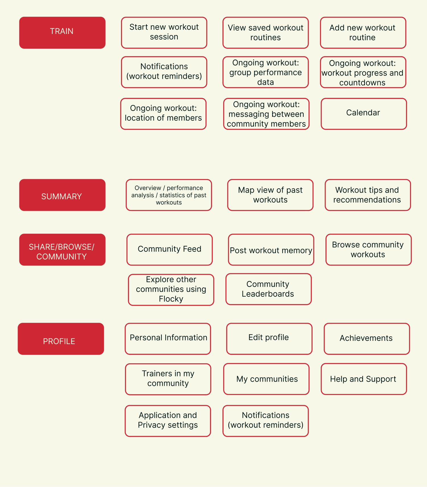
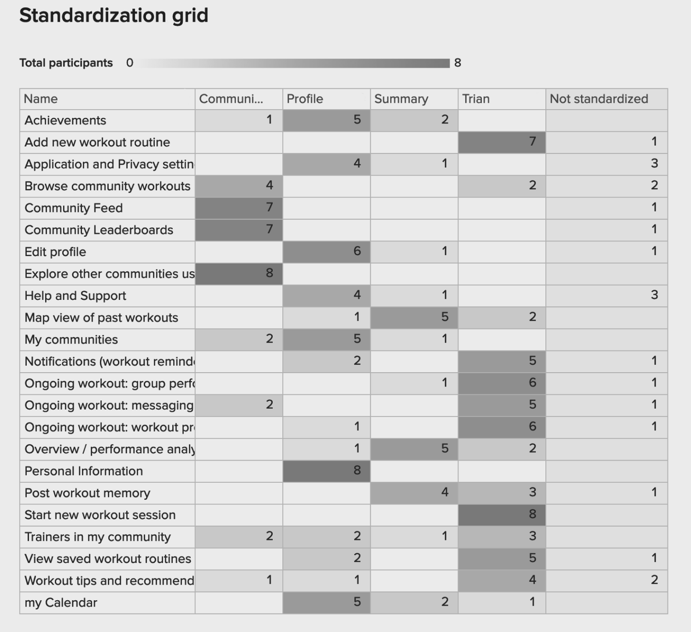
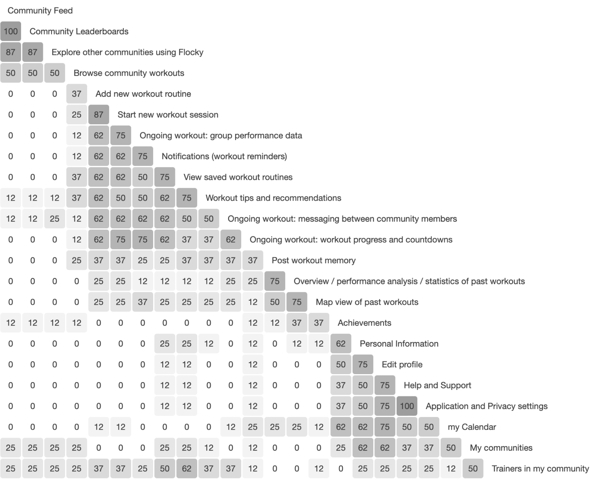
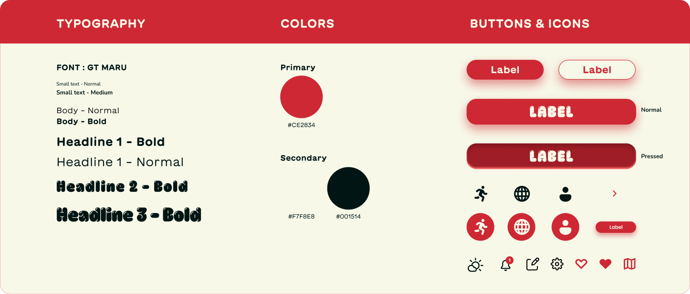
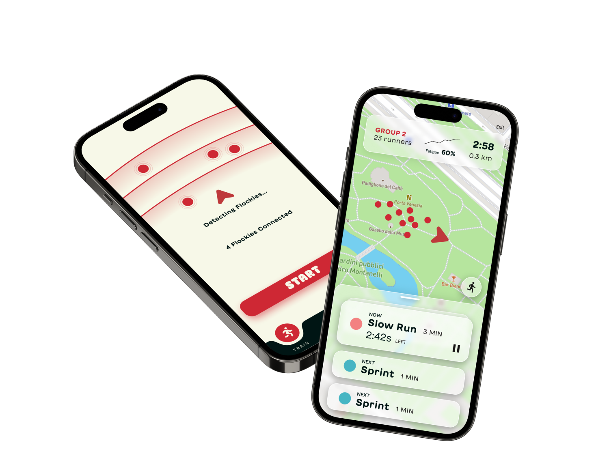
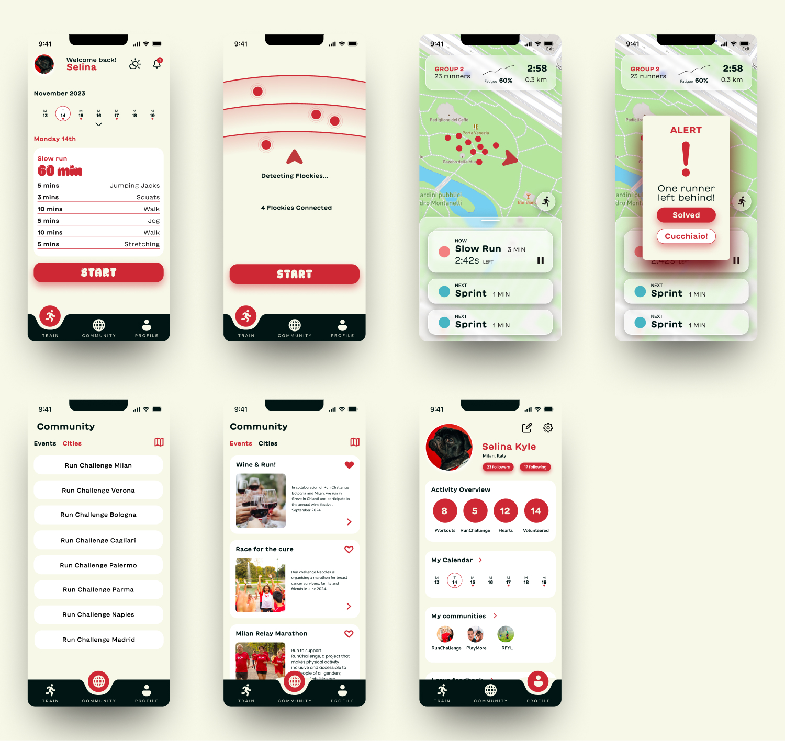

## Card Sorting

### Card Sorting Exercise Results

In order to better understand user expectations and preferences for the trainer app navigation structure, we conducted a card sorting exercise with a group of participants. The primary goal of this exercise was to gain insights into how users categorize and organize our app content.

### Methodology

- We conducted a hybrid card sorting exercise, providing participants with a predefined set of categories with the ability to add new categories into which they were asked to sort a list of content items.
- A total of approximately 10 participants were recruited for the exercise.
- Participants were asked to sort 24 content items

### Results and Analysis

After collecting and analyzing the data from the card-sorting exercise, the following key insights emerged:

1. **Strong Consensus on Main Categories**: Participants showed a strong consensus in organizing content into four main categories which we have provided already: "Profile," "Train," "Community," and "Summary."
2. **New categories**: While the main categories were consistent, participants had varying opinions on the new categorization.
3. **Outliers**: A few content items were consistently placed in different categories by different participants, indicating potential ambiguity or the need for clearer labeling, as you can see below images extracted from the workspace we have used to conduct card sorting called “Optimal Workshop”

## Design Implications

Based on the card sorting results, the following design implications were identified:

- The main navigation menu should prominently feature the four main categories: "Train," "Profile," "Summary" and "Sharing."
- Ambiguous or unclear content labels should be revised to improve user comprehension.
- These interpretations led us to the Information architecture of our system.

---

Source: https://dxrrwzcy.optimalworkshop.com/optimalsort/jllz0r8a

_Fig. 3.1 – Our cards and categories, they are ready for the app IA_

_Fig. 3.2 – Standardization grid for the card sorting results_

_Fig. 3.3 – Similarity matrix for the card sorting result_

## Wireframes

From the Architecture and User Flow, we had a clear idea regarding the structure of the app. **6 screens** were identified to give a holistic view of the system and its interaction.

The selected screens were:

- **Syncing Devices -** The trainer connects all Flockies to the app.
- **Workout Schedule -** An overview of activities for the current day along with an option to see the schedule of rest of the days in that week.
- **Workout with Activity details and Map -** Active screen during a session that shows a map with the locations of various participants and the trainer. Details of the current and consecutive activities. An overview of the groups’ performance statistics.
- **Community Cities -** Shows a list of cities where Run Challenge is present.
- **Community Events -** List of events related to the community.
- **Account -** Summary of the user’s activities, their schedule and interested communities.

_Fig. 3.4 – Wireframes_

## Hi-Fi Iteration

_Fig. 3.5 – Design System_

_Fig. 3.6 – App Mockup_

_Fig. 3.5 – High Fidelity Screens_
