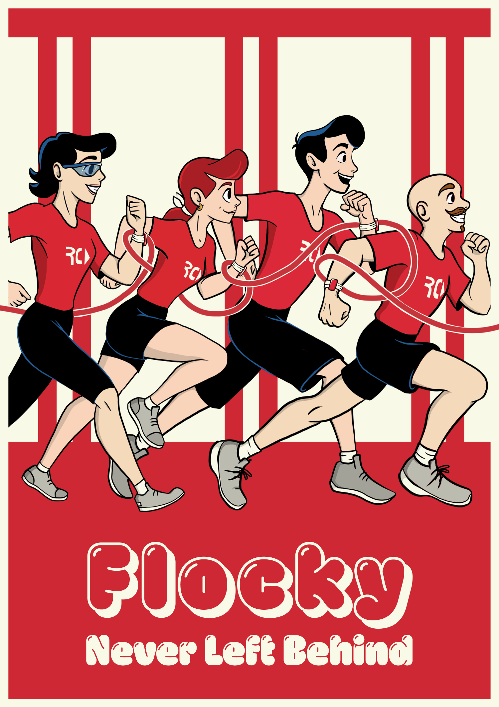
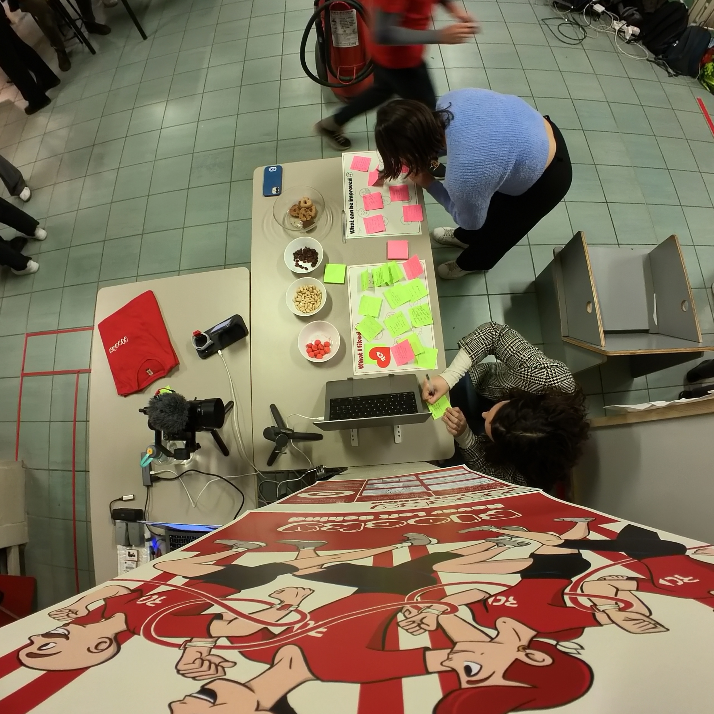

import { Tabs, TabItem, CardGrid } from "@astrojs/starlight/components";
import Vimeo from "../../../components/Vimeo.astro";

<Vimeo vimeoId="895001344" controls="false">
  _Fig. 4.1 – Demo Madness Behind the Scenes_
</Vimeo>

## The Stand

_Fig. 4.2 – Madness Stand_

<Tabs>
  <TabItem label="01 - Intro">
    
    _Fig. 4.3 – Introducing our Project to Davide Lovino, form RunChallenge_

    Here the visitors were welcomed and the project was introduced, explaining the relationship with RunChallenge

  </TabItem>
  <TabItem label="02 - Poster">
    <CardGrid>
    
    _Fig 4.4 – Solution Poster_

    
    _Fig 4.5 – Branding Poster_
    </CardGrid>

    The Solution Poster quickly illustrated the key points of our solution, thanks also to some visual storyboard of the scenario.

We also had a Branding Poster, showcasing the core value of our solution: the RunChallenge runners happily jogging connected by the Flocky system.

  </TabItem>
  <TabItem label="03 - Demo">
    <Vimeo vimeoId="896102260" controls="false">_Demo Madness Full_</Vimeo>

    For the demo, we wanted to give our testers an immersive experience, by making them try a real-time running session. Since we couldn’t take them for an actual run, we decided to project two POV shots on the wall.

     <CardGrid>
    
    _Fig. 4.6 – Staff member helps wearing the Flocky Prototype_

    The footage was synced with a master Adafruit board, connected with the two bracelets, that we gave to our testers.
    </CardGrid>

    One user is the “Helper”, the person who receives feedback when someone around falls behind.

    The other one is the person falling behind, who will see their Flocky glowing when left behind, to signal the transmission of information.

_Fig. 4.7 – Triyng the Flocky Demo_

  </TabItem>
  <TabItem label="04 - Feedbacks">
  
_Fig. 4.8 – Receiving some feedbacks_

Finally, the visitors could give us some critical feedback and be rewarded with some candies or cookies.

  </TabItem>
</Tabs>

### Gaussian Splatting

On one screen we also had this looping 3D scene captured with Gaussian Splatting, to give more dynamism to the stand. Besides showcasing the product in a cool and interesting way, it helped to break the ice with some curious students.

<iframe
  src="https://lumalabs.ai/embed/df667dae-94af-420c-897f-eb55de6b2608?mode=sparkles&background=%23ffffff&color=%23000000&showTitle=true&loadBg=true&logoPosition=bottom-left&infoPosition=bottom-right&cinematicVideo=undefined&showMenu=false"
  class="aspect-video"
  width="1024"
  height="720"
  frameborder="0"
  title="luma embed"
  style="border: none;"
></iframe>
_Fig. 4.9 – Gaussian Splatting_

## Feedbacks

During the madness, we were able to collect a lot of precious feedback. (The fact that the experience could be done by two people at a time only benefited us from this point of view). Among these feedbacks, we were lucky enough to also have the ones of Davide Lovino, one of RunChallenge's leaders and creators, who took the time to come and visit us, try out the demo, and, once again, express his support and excitement for our project.

### Positive Feedbacks

_Fig. 4.10 – Positive Feedbacks_

We collected 37 positive feedbacks, that mostly appreciated the simplicity and effectiveness of our solution, always pointing out how this technology could easily be embedded in other contexts. Other comments were about the demo itself, and how people liked the way we structured it, making it fun and immersive.
All this gave us a great boost in self-esteem.

### What can be improved

_Fig. 4.11 – Negative Feedbacks_

Even more useful were the "What can be improved" feedbacks, we collected 25 of them.
Regarding the concept, some people suggested specifying, or better defining, what it means "to help" in our context. We generalized a bit in terms of roles, just defining Trainers and Runners. It could be useful to have also a Volunteer category, that can have more responsibilities. Also, Davide pointed this out.
Others suggested better explaining what each haptic pattern means during the run. They also suggested to maybe add auditory feedback, to make it easier to find the missing person.

Regarding the demo itself, some people were legitimately confused about the roles they had to enact: even before the actual demo started they thought they were going to be a Runner and the Trainer, or at least they expected the Trainer to be involved, as a third panel of the split screen. This would've made the demo much more clear and comprehensive.

## Group photo

_Fig. 4.12 – The whole Flocky team at the Madness_
