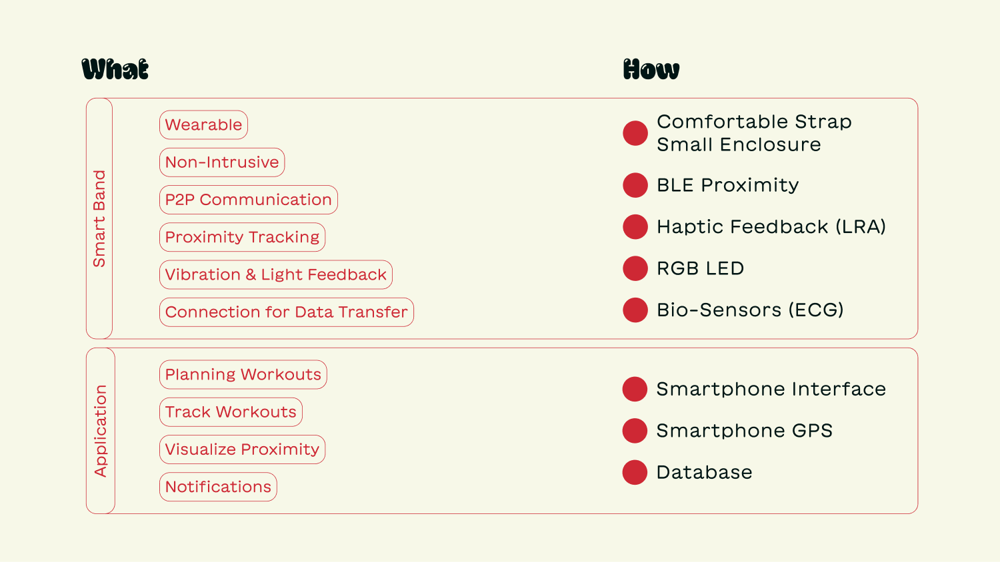
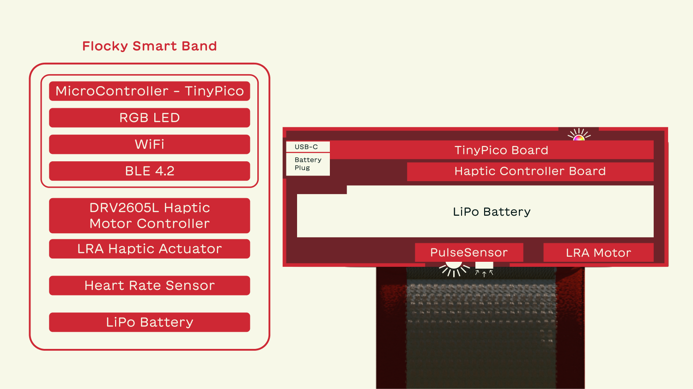
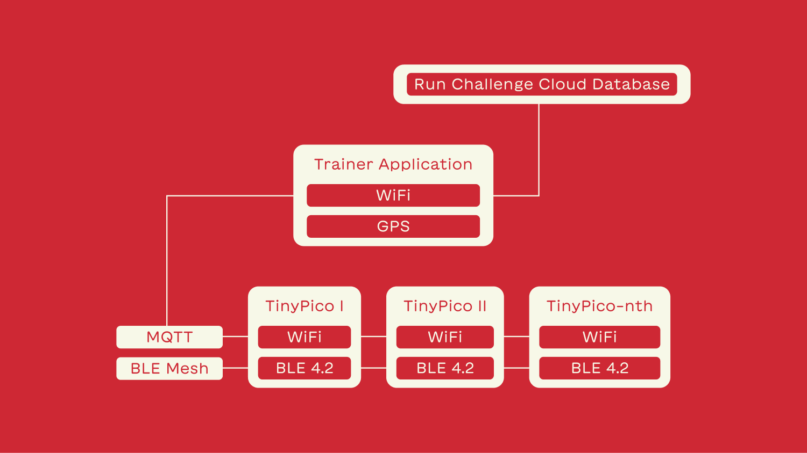
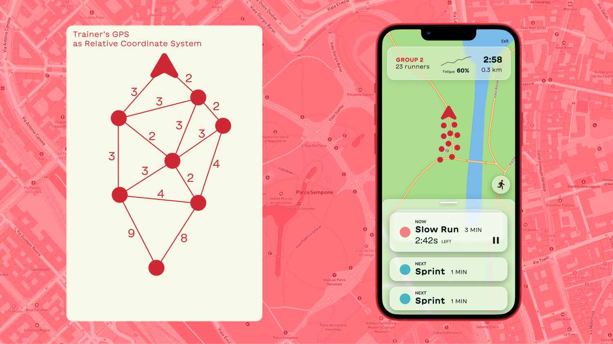
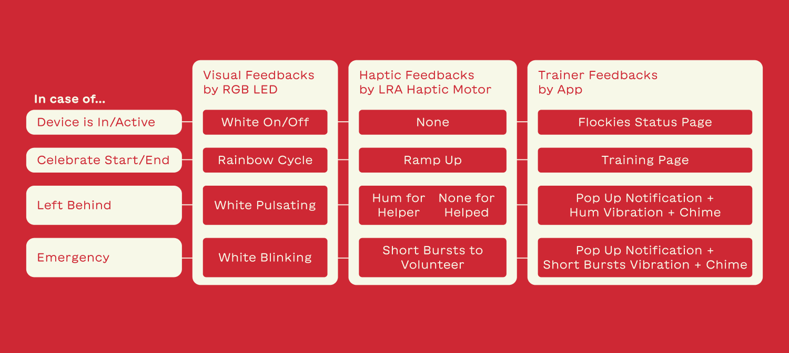
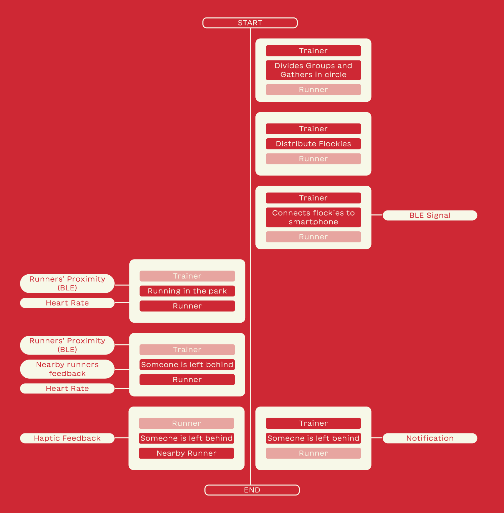
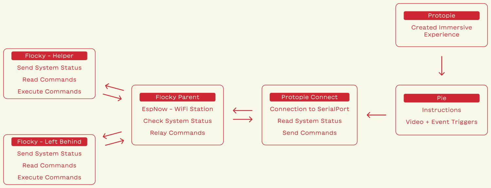

## The Why of Technology

Before describing all the technical aspects of the project it is necessary to spend a few words about the philosophy throughout the development of Flocky, which helped us avoid using technology for the sake of technology, and provide a meaningful experience.

Moreover, our design principles were rooted in the realm of natural interaction, recognizing the importance of seamlessly integrating technology into users' lives without imposing undue disruptions, but by leveraging familiar and intuitive behavioral patterns.

In our journey to envision a new solution for trainers and runners of different abilities, the first requirement we set to accomplish was to envision a solution that would be the l**east intrusive as possible**, for that we took inspiration from the principles of Calm Technology by Amber Case.

- Allow the technology to blend in the natural human behavior
- Constant presence does not require active attention

## Principles of Calm Technology

1. Technology should require the smallest possible amount of attention
2. Technology should inform and create calm
3. Technology should make use of the periphery, informing without overburdening
4. Technology should amplify the best of technology and the best of humanity
5. Technology can communicate but doesn’t need to speak
6. Technology should work even when it fails
7. The right amount of technology is the minimum needed to solve the problem
8. Technology should respect social norms

## What Technology?

From the envisioned new meaning and our concept idea, it was then the time to define all the key design features of the system and the enabling technologies.

Starting from the Smart Band it was clear that the system had to be wearable, yet not intrusive, so efforts had to be made to sew an elastic band adaptable to any wrist size, be tight enough to provide accurate heart rate readings, but be lightweight and comfortable. The pulsating heart of each flocky, the microcontroller with BLE and WiFi connectivity had to do the heavy lifting of the operations:

- Establish a connection with nearby Flockies and the trainer if in range
- Track the proximity of said devices
- Store ECG data and detect abnormal parameters
- Provide feedback based on events

The application for the trainer meanwhile had to be the control center where to check in real-time the status of the runner, fatigue, and position, but also track performance for tracking and planning the workouts.


_Fig 4.1 – Key design features of each touchpoint and corresponding enabling technology_

## How does it work?

The Flocky ecosystem relies on the interconnection of the mesh of smart bands with the application of the trainer, at the core this is possible by exploiting the coexistence of Bluetooth and WiFi.


_Fig 4.2 – Smartband components architecture and section view of the internal components setup_

Bluetooth is used to create a peer-to-peer network between the smart bands to track each other proximity, while the WiFi connection through the MQTT protocol is used to transmit relevant data, like notifications on the runners’ status, to the trainer’s device. Finally, all the tracked data is uploaded from the trainer device to a cloud database, so it would be possible to access, monitor, and plan workouts.


_Fig 4.3 – Communication Protocol Model_

The positioning system works by combining the GPS tracking on the trainer’s device and the relative coordinate system obtained from the triangulation of the proximity of the smart bands.


_Fig 4.4 – Abstraction of Position calculationZ_

```jsx
import trilat from "trilat/index.js";

export const locate = (beacon, stations, px_meter) => {
  // RSSI = TxPower - 10 * n * lg(d)
  // n = 2...4
  // d = 10^(TxPower - RSSI) / (10 * n))

  function calculateDistance(rssi) {
    let P = -69; // empirical (nice) value ideally it should come from MQTT message
    let n = 3;
    let d = Math.pow(10, (P - rssi) / (10 * n)); //(n ranges from 2 to 4)
    return d * px_meter;
  }

  var keysSorted = Object.keys(beacon).sort(function (a, b) {
    return beacon[a].rssi - beacon[b].rssi;
  });
  keysSorted.reverse();

  let input = [
    //      X     Y     R
    [
      parseInt(stations[keysSorted[0]].x, 10),
      parseInt(stations[keysSorted[0]].y, 10),
      calculateDistance(beacon[keysSorted[0]].rssi),
    ],
    [
      parseInt(stations[keysSorted[1]].x, 10),
      parseInt(stations[keysSorted[1]].y, 10),
      calculateDistance(beacon[keysSorted[1]].rssi),
    ],
    [
      parseInt(stations[keysSorted[2]].x, 10),
      parseInt(stations[keysSorted[2]].y, 10),
      calculateDistance(beacon[keysSorted[2]].rssi),
    ],
  ];

  let output = trilat(input);
  let coords = {
    x: parseInt(output[0], 10),
    y: parseInt(output[1], 10),
  };
  return coords;
};
```

_Fig 4.5 – Code for triangulation between three devices_

Particular attention has been dedicated to finding the right amount of attention-grabbing feedback while still maintaining a non-disruptive experience.


_Fig 4.6 – Matrix of the Events Feedback_


_Fig 4.7 – Choreography model of the interaction with Flocky from the perspective of the Trainer and the Runner_

## Protopie Connections


_Fig. 4.8 – Protopie Connections_

Protopie and Protopie Connect were used to carry out a demo of the final experience to test the MVP and the experience while using it.

Commonly, interfaces are imported to take advantage of the advanced prototyping tools, we thought outside the box.

We projected a presentation with instructions and information and a video of the running experience with Flocky to make users roleplay in the scenario, during the video some events are triggered, and commands are sent to the Flocky smart band that will send the corresponding feedback.

## Potentiality of this Technology

As also emerged from various feedback, the technology that Flocky implements can prove useful in a great many cases, going to improve the quality of certain activities without being intrusive.
Monitoring groups of people on the move can be found in school field trips, pedibuses, educational outings, excursions, and so on.

The potential and effectiveness would be even greater in an indoor space: through fixed antennas, careful mapping, and customized RFID tags, for example, it would be possible to track the movement of each individual in a nursing home or players in a gymnasium.
Effectively, this method is already used in the case of American Football, where each player is precisely tracked.

The great advantage of Flocky is its versatility, being implementable in any location, and not requiring fixed detectors.


_Fig 4.8 – Potential applications of the Flocky technology_
