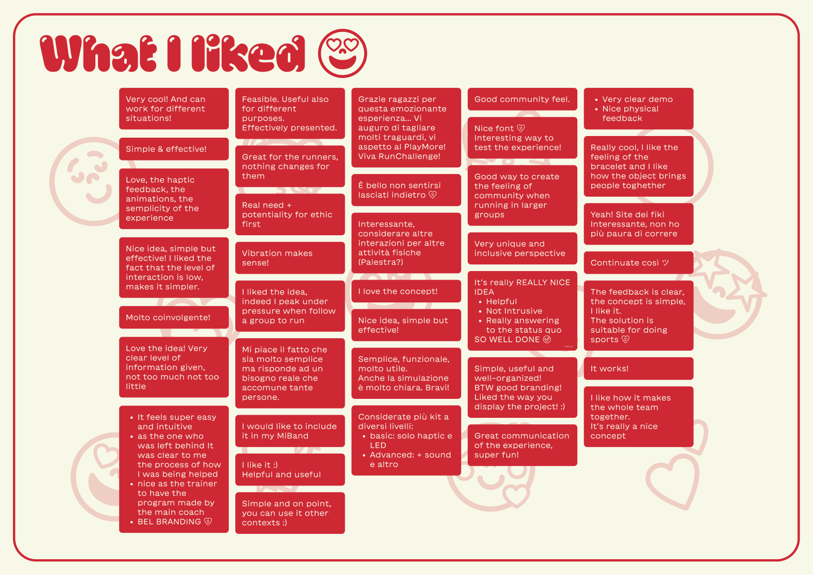

import Video from "../../../img/madness/Bivacco_Cam.webm";

# Project Madness

<video width="" height="" class="h-auto w-full" autoplay>
  <source src={Video} type="video/webm" />
</video>

## The Stand

_Madness Stand_

## Feedbacks

During the madness, we were able to collect a lot of precious feedback. (The fact that the experience could be done by two people at a time only benefited us from this point of view). Among these feedbacks, we were lucky enough to also have the ones of Davide Lovino, one of RunChallenge's leaders and creators, who took the time to come and visit us, try out the demo, and, once again, express his support and excitement for our project.

_Positive Feedbacks_

We collected 37 positive feedbacks, that mostly appreciated the simplicity and effectiveness of our solution, always pointing out how this technology could easily be embedded in other contexts. Other comments were about the demo itself, and how people liked the way we structured it, making it fun and immersive.
All this gave us a great boost in self-esteem.

_Negative Feedbacks_

Even more useful were the "What can be improved" feedbacks, we collected 25 of them.
Regarding the concept, some people suggested specifying, or better defining, what it means "to help" in our context. We generalized a bit in terms of roles, just defining Trainers and Runners. It could be useful to have also a Volunteer category, that can have more responsibilities. Also, Davide pointed this out.
Others suggested better explaining what each haptic pattern means during the run. They also suggested to maybe add auditory feedback, to make it easier to find the missing person.

Regarding the demo itself, some people were legitimately confused about the roles they had to enact: even before the actual demo started they thought they were going to be a Runner and the Trainer, or at least they expected the Trainer to be involved, as a third panel of the split screen. This would've made the demo much more clear and comprehensive.

[Get this theme on GitHub](https://github.com/markteekman/accessible-astro-starter)

## Next
